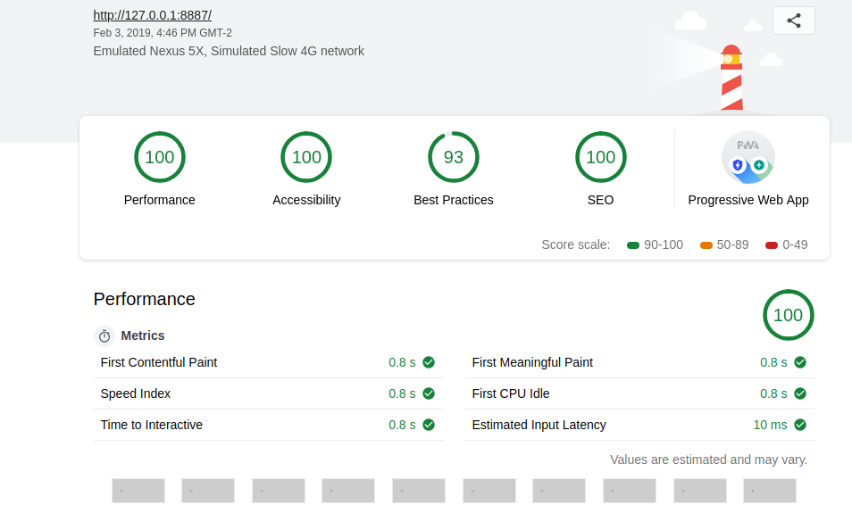
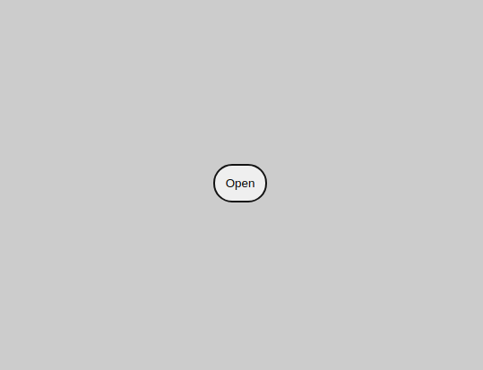
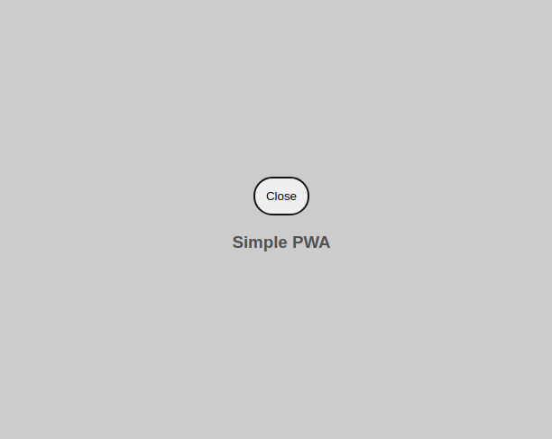

# projetos PWA
Projetos e estudo sobre PWA porque acho uma boa alternativa para aplicaçãoes Mobile.
Sou progrador Backend de origen então o CSS é a parte que acho mais complicada.

## Openbox
vanila css e js

utiliza: workbox, passou em todos os testes do lighthouse

baseado no curso do [google](https://github.com/googlecodelabs/your-first-pwapp)

Screenshot
- lighthouse 
- estado inicial 
- estado final 

-----
